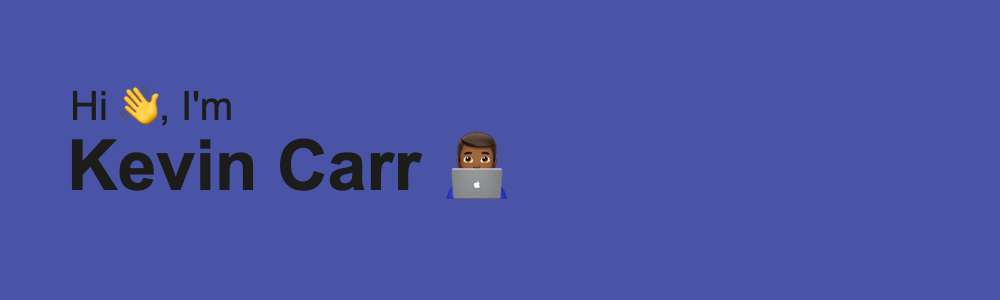

Working with a cross-functional team building amazing customer facing software products with a key focus on user experience is what I love to do.

- 💻  ---> Connect with me on [Linkedin](https://www.linkedin.com/in/kevin-carr-/)
- 🤔  ---> Learn a bit more [about me](https://www.kevincarr.dev) 
- 📫  ---> How to reach me: kevincarr632@gmail.com

<!--
**kevcarr11/kevcarr11** is a ✨ _special_ ✨ repository because its `README.md` (this file) appears on your GitHub profile.

Here are some ideas to get you started:

- 🔭 I’m currently working on ...
- 🌱 I’m currently learning ...
- 👯 I’m looking to collaborate on ...
- 🤔 I’m looking for help with ...
- 💬 Ask me about ...
- 😄 Pronouns: ...
- ⚡ Fun fact: ...
-->
